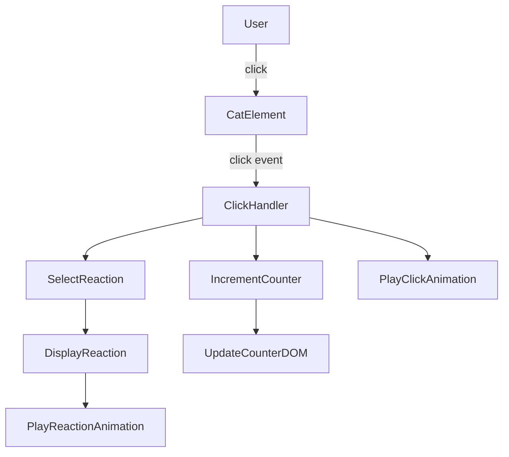

# Design Document: Cat Clicker App

## Overview

A single-file, zero-dependency cat clicker web app. The user sees a cat emoji centered on the page, clicks it to increment a counter and trigger a random animated reaction. The entire app ships as one `index.html` file using Tailwind CSS via CDN and Vanilla JavaScript.

No build step, no server, no frameworks — just open the file in a browser.

## Architecture

The app is a single HTML file with three logical layers inlined:

```
index.html
├── <head>   — Tailwind CDN link, custom CSS keyframes
├── <body>   — Semantic HTML structure
└── <script> — App state + event logic (Vanilla JS)
```



All state lives in plain JS variables. DOM updates are direct (no virtual DOM, no framework).

## Components and Interfaces

### Cat Element
- A `<div>` or `<button>` containing the cat emoji (🐱) or an ``
- Centered via Tailwind flexbox utilities on the page
- Receives the `click` event listener
- Plays the bounce animation class on click, removed via `animationend` event

### Click Counter
- A `<p>` or `<span>` element showing "Clicks: N"
- Updated directly via `textContent` on each click

### Reaction Display
- A `<div>` positioned near the cat (above or overlaid)
- Shows the current reaction text/emoji
- Plays a fade-in/float-up animation on each new reaction
- Animation is re-triggered by removing and re-adding the animation class

### App State (JS)
```js
let clickCount = 0;
let lastReactionIndex = -1;
const reactions = [ /* 6+ strings */ ];
```

### Core Functions
```js
function handleCatClick()       // orchestrates counter, reaction, animations
function selectReaction()       // picks random reaction, no consecutive duplicate
function playClickAnimation()   // adds/removes bounce CSS class on cat
function showReaction(text)     // updates reaction DOM, re-triggers animation
function updateCounter()        // updates counter DOM
```

## Data Models

### App State
| Field | Type | Description |
|---|---|---|
| `clickCount` | `number` | Total clicks since page load, starts at 0 |
| `lastReactionIndex` | `number` | Index of last shown reaction, -1 on init |
| `reactions` | `string[]` | Pool of 6+ reaction strings/emojis |

### Reaction Pool (minimum 6)
```js
const reactions = [
  "😻 So cute!",
  "🐾 Purrfect!",
  "😺 Meow!",
  "🙀 Whoa!",
  "😸 Hehe!",
  "💕 Loves it!",
  "🐟 Feed me!",
  "😹 LOL!"
];
```

### Animation Constraints
| Animation | Trigger | Duration |
|---|---|---|
| Cat bounce | click | ≤ 300ms |
| Reaction fade/float | reaction display | ≤ 500ms |

### CSS Keyframes
```css
@keyframes catBounce {
  0%, 100% { transform: scale(1); }
  50%       { transform: scale(1.3); }
}
@keyframes reactionFloat {
  0%   { opacity: 0; transform: translateY(10px); }
  100% { opacity: 1; transform: translateY(0); }
}
```


## Correctness Properties

*A property is a characteristic or behavior that should hold true across all valid executions of a system — essentially, a formal statement about what the system should do. Properties serve as the bridge between human-readable specifications and machine-verifiable correctness guarantees.*

### Property 1: Counter-DOM Sync

*For any* sequence of cat clicks, the click count displayed in the DOM must always equal the number of times the cat has been clicked since page load.

**Validates: Requirements 2.2, 2.3**

### Property 2: Reaction Always In Pool

*For any* click on the cat, the reaction text displayed in the DOM must be a member of the predefined reaction pool.

**Validates: Requirements 3.1, 3.3**

### Property 3: No Consecutive Duplicate Reactions

*For any* sequence of two or more consecutive clicks, no two adjacent clicks may produce the same reaction string.

**Validates: Requirements 3.5**

## Error Handling

Since this is a purely client-side static app with no network calls or user input beyond clicks, the error surface is minimal:

- **Animation class cleanup**: If the user clicks rapidly, the bounce animation class must be removed before re-adding it (force reflow) to ensure the animation re-triggers correctly. Use `element.classList.remove`, force reflow via `element.offsetWidth`, then re-add.
- **Reaction pool exhaustion guard**: `selectReaction` must handle the edge case where the pool has exactly 1 item (infinite loop risk). The pool is hardcoded with 8 items, so this is not a runtime concern, but the function should be written defensively.
- **DOM element availability**: All DOM queries happen after `DOMContentLoaded` or at the bottom of `<body>`, so null references are not expected.

## Testing Strategy

### Dual Testing Approach

Both unit tests and property-based tests are used. Unit tests cover specific examples and edge cases; property tests verify universal correctness across many generated inputs.

### Unit Tests (specific examples)

- Cat element exists in DOM on load (Req 1.1)
- Reaction pool has ≥ 6 distinct entries (Req 3.2)
- Bounce CSS class is added to cat element on click (Req 4.1)
- Reaction animation class is added to reaction element on click (Req 4.2)
- Tailwind CDN `<link>` is present in `<head>`, no local CSS build (Req 5.2)
- No `<script src>` tags pointing to frameworks (Req 5.3)

### Property-Based Tests

Use a property-based testing library appropriate for Vanilla JS: **fast-check** (loaded via CDN or npm for test runs only).

Each property test runs a minimum of **100 iterations**.

**Property 1: Counter-DOM Sync**
```
// Feature: cat-clicker-app, Property 1: Counter-DOM Sync
// For any N clicks (N >= 0), counter DOM text equals N
fc.assert(fc.property(fc.integer({ min: 0, max: 200 }), (n) => {
  resetApp();
  for (let i = 0; i < n; i++) simulateClick();
  return getCounterValue() === n;
}), { numRuns: 100 });
```

**Property 2: Reaction Always In Pool**
```
// Feature: cat-clicker-app, Property 2: Reaction Always In Pool
// For any number of clicks, displayed reaction is always in the pool
fc.assert(fc.property(fc.integer({ min: 1, max: 100 }), (n) => {
  resetApp();
  for (let i = 0; i < n; i++) simulateClick();
  return reactions.includes(getDisplayedReaction());
}), { numRuns: 100 });
```

**Property 3: No Consecutive Duplicate Reactions**
```
// Feature: cat-clicker-app, Property 3: No Consecutive Duplicate Reactions
// For any sequence of clicks, no two adjacent reactions are the same
fc.assert(fc.property(fc.integer({ min: 2, max: 100 }), (n) => {
  resetApp();
  const seen = [];
  for (let i = 0; i < n; i++) {
    simulateClick();
    seen.push(getDisplayedReaction());
  }
  return seen.every((r, i) => i === 0 || r !== seen[i - 1]);
}), { numRuns: 100 });
```

### Test Helpers

To make the JS logic testable, the core functions (`selectReaction`, `updateCounter`, `showReaction`) should be written as pure or near-pure functions that can be called independently of the DOM, with DOM updates isolated to thin wrapper calls.
